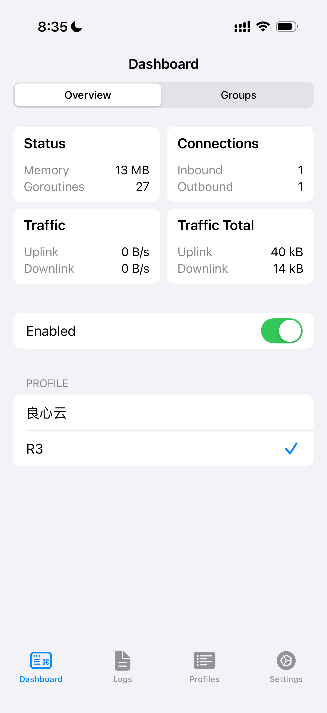
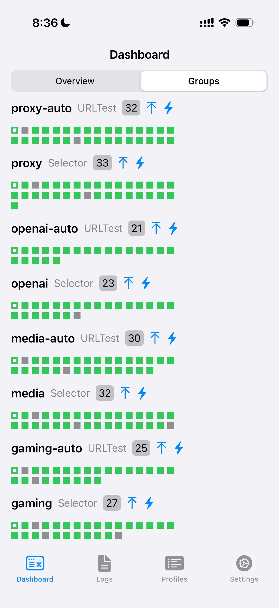

# singbox-manager 🚀

[中文说明](./README.md)

Turn a subscription link into a sing-box profile you can import on all your devices.

This project runs on Cloudflare Workers and builds a ready-to-use sing-box config from:

- your provider subscription
- BlackMatrix7 rule lists
- a simple routing setup for `proxy`, `openai`, `media`, and `gaming`

## Features ✨

- One default profile URL for day-to-day use
- Apple-friendly config generation for older sing-box iOS builds
- Fastest-node auto selection with `urltest`
- Automatic grouping for general traffic, OpenAI, media, and gaming
- BlackMatrix7-based routing rules
- Cloudflare Worker deployment
- GitHub Actions refresh flow when the upstream subscription blocks Worker fetches

## Screenshots 📱

Overview on iOS after import and enable:



Group view on iOS with auto-tested selectors:



## Quick Start ⚡

1. Install dependencies:

```bash
npm install
```

2. Log into Cloudflare:

```bash
npx wrangler login
```

3. Set your secrets:

```bash
npx wrangler secret put SUBSCRIPTION_URL
npx wrangler secret put ACCESS_TOKEN
npx wrangler secret put ADMIN_TOKEN
```

4. Deploy:

```bash
npx wrangler deploy
```

5. Import the generated profile into sing-box:

```text
https://YOUR-WORKER.workers.dev/config/default.json?access_token=YOUR_TOKEN
```

## How It Works 🛠️

When a device pulls the profile, the Worker:

1. loads your subscription
2. parses supported nodes like `vless`, `trojan`, `ss`, `vmess`, and `hysteria2`
3. builds selector and `urltest` groups
4. applies category routing from BlackMatrix7
5. returns a sing-box config that is ready to import

The default profile is designed to be the one most people use. Advanced device and compatibility overrides still exist, but they are optional.

## Updates 🔄

Some providers block direct Cloudflare Worker fetches. This project supports a fallback flow:

- GitHub Actions fetches the subscription outside Cloudflare
- the latest snapshot is uploaded to Worker storage
- optional profile mirrors can be refreshed from the same workflow

The included workflow is:

- `.github/workflows/refresh-subscription.yml`

Useful repository secrets for automation:

- `SUBSCRIPTION_URL`
- `WORKER_UPLOAD_URL`
- `WORKER_CONFIG_URL`
- `GIST_ID`
- `GIST_TOKEN`

## Development 🧪

Run the local checks:

```bash
npm run check
npm test
```

Main files:

- `src/index.js`
- `wrangler.toml`
- `tests-smoke.js`

## Security 🔐

This repository is meant to stay free of real secrets.

- Do not commit real subscription URLs with tokens
- Do not commit Worker secrets
- Do not publish private profile URLs in the README
- Treat any unlisted mirror URL as sensitive, because the generated config contains real server credentials
